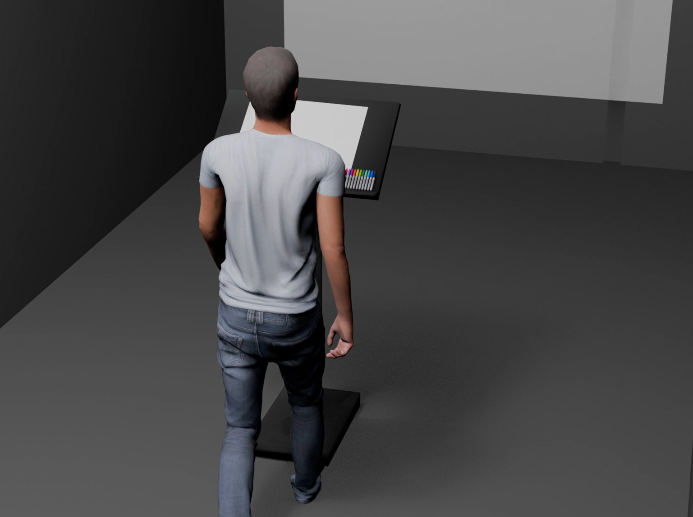

# Ikrame Rata

## Réalisations

 <!-- Une image par semaine de la réalisation dont tu es le plus fier avec une légende -->

### S1 Développement du concept

Recherche approfondie sur les fondements scientifiques qui soutiennent la conception du projet, notamment l’impact des sons et des couleurs sur la perception et les émotions.

---

### S2 Réajustement et redéfinition du projet

Ikrame a retravaillé l’idée du projet en approfondissant la réflexion scientifique qui la soutient et en s’assurant de sa cohérence. Elle a également réalisé une simulation en 3D du projet afin de mieux visualiser son fonctionnement et d’anticiper les contraintes techniques.

---

### S3 Expérimentations et tests

Ikrame a concrétisé l’espace de travail en prenant les mesures nécessaires et en affinant la maquette, notamment en réfléchissant à l’emplacement des éléments. Elle a également anticipé les problèmes techniques potentiels pour mieux adapter la conception.

### S4 Présentation de la maquette

Ikrame a travaillé sur l'intégration de l'interaction entre le dessin et la projection ainsi que sur la synchronisation entre le son et l’image.

### S5 Repositionnement et réintégration du plan d'espace

Ikrame a travaillé sur le repositionnement et la réintégration du plan d’espace, en ajustant l’agencement pour optimiser l’interaction entre les éléments. Ce travail vise à améliorer l’expérience immersive en intégrant harmonieusement les différentes composantes du projet dans l’espace global.

### S6 Travail sur les visuels du jaune et violet

Ikrame a travaillé sur l’intégration visuelle des couleurs jaune et violet, en affinant leur représentation et en s’assurant qu’elles étaient cohérentes avec l’esthétique globale du projet. Elle a également ajusté les éléments visuels pour renforcer l’impact de ces couleurs dans l’interaction immersive.

### S7 Travail sur les Sons du mauve et jaune et structure de l'installation

Ikrame a travaillé sur la conception sonore associée aux couleurs mauve et jaune, en affinant les ambiances sonores pour correspondre à l’expérience visuelle. Elle a également porté une attention particulière à la structure et à la peinture de l’installation, en veillant à l’harmonie entre les éléments visuels, sonores et physiques.

### S8 Collaboration sur les derniers détails de l'installation

Ikrame a collaboré avec son équipe pour peaufiner les derniers détails de l’installation, s’assurant que tous les éléments visuels, sonores et techniques étaient parfaitement intégrés. Elle a supervisé l’ensemble du processus pour garantir une cohérence finale et une expérience immersive optimale.
