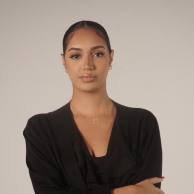
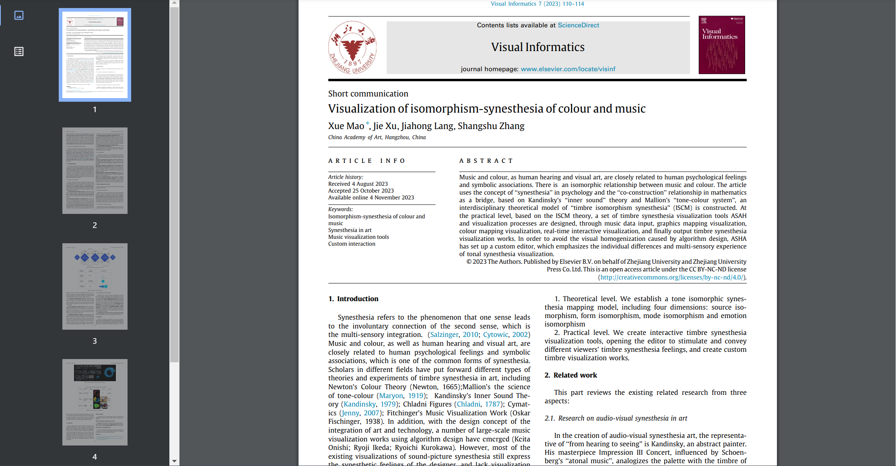
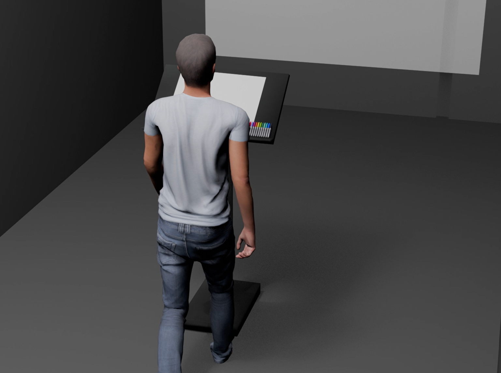

# Ikrame Rata

## Réalisations

 <!-- Une image par semaine de la réalisation dont tu es le plus fier avec une légende -->

### S1 Développement du concept

Recherche approfondie sur les fondements scientifiques qui soutiennent la conception du projet, notamment l’impact des sons et des couleurs sur la perception et les émotions.

---

### S2 Réajustement et Redéfinition du Projet

Ikrame a retravaillé l’idée du projet en approfondissant la réflexion scientifique qui la soutient et en s’assurant de sa cohérence. Elle a également réalisé une simulation en 3D du projet afin de mieux visualiser son fonctionnement et d’anticiper les contraintes techniques.

---

### S3 Expérimentations et Tests

Ikrame a concrétisé l’espace de travail en prenant les mesures nécessaires et en affinant la maquette, notamment en réfléchissant à l’emplacement des éléments. Elle a également anticipé les problèmes techniques potentiels pour mieux adapter la conception.

### S4 Présentation de la maquette

Ikrame a travaillé sur l'intégration de l'interaction entre le dessin et la projection ainsi que sur la synchronisation entre le son et l’image.
