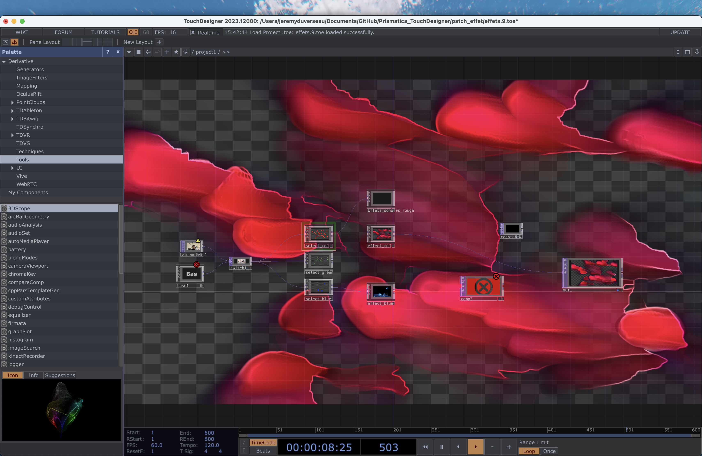

# Jérémy Duverseau

## Réalisations

 <!-- Une image par semaine de la réalisation dont tu es le plus fier avec une légende -->

### S1 Développement du concept

Jérémy a développé un mapping associant chaque couleur à des éléments spécifiques du projet, afin de créer une correspondance cohérente entre les teintes et leur signification dans l’expérience utilisateur.

<iframe style="border: 1px solid rgba(0, 0, 0, 0.1);" width="800" height="450" src="https://embed.figma.com/board/01QeudLWkBospPA8fs9Bte/Brainstorm?node-id=0-1&embed-host=share" allowfullscreen></iframe>

### S2 Réajustement et Redéfinition du Projet

Jérémy a exploré et développé plusieurs concepts visuels pour adapter l’esthétique du projet et a également conçu le logo officiel.

### S3 Développement du concept

Jérémy a développé le visuel de la couleur rouge, explorant des approches graphiques et esthétiques pour assurer une cohérence visuelle avec l’expérience immersive du projet.

### S4 Présentation de la maquette

Jérémy a peaufiné les visuels de la projection pour assurer une meilleure lisibilité et fluidité de l’animation.
