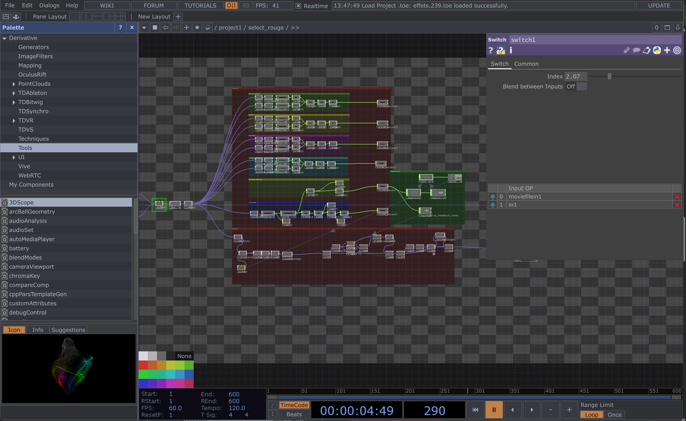

# Jérémy Duverseau

## Réalisations

 <!-- Une image par semaine de la réalisation dont tu es le plus fier avec une légende -->

### S1 Développement du concept

Jérémy a développé un mapping associant chaque couleur à des éléments spécifiques du projet, afin de créer une correspondance cohérente entre les teintes et leur signification dans l’expérience utilisateur.

<iframe style="border: 1px solid rgba(0, 0, 0, 0.1);" width="800" height="450" src="https://embed.figma.com/board/01QeudLWkBospPA8fs9Bte/Brainstorm?node-id=0-1&embed-host=share" allowfullscreen></iframe>

### S2 Réajustement et Redéfinition du Projet

Jérémy a exploré et développé plusieurs concepts visuels pour adapter l’esthétique du projet et a également conçu le logo officiel.

### S3 Développement du concept

Jérémy a développé le visuel de la couleur rouge, explorant des approches graphiques et esthétiques pour assurer une cohérence visuelle avec l’expérience immersive du projet.

### S4 Présentation de la maquette

Jérémy a peaufiné les visuels de la projection pour assurer une meilleure lisibilité et fluidité de l’animation.

### S5 Travail sur les visuels du rouge et bleu

Jérémy a travaillé sur les visuels des couleurs rouge et bleu, en explorant différentes approches graphiques pour garantir que ces teintes s’intègrent harmonieusement dans l’expérience immersive du projet. Il a ajusté les éléments visuels pour créer une interaction fluide et cohérente entre les deux couleurs, en tenant compte de leur signification et de leur impact émotionnel.

### S6 Travail sur les sons du bleu et du vert

Jérémy a travaillé sur l'intégration sonore des couleurs bleu et rouge, en développant des ambiances sonores qui correspondent à l’intensité et aux émotions évoquées par ces couleurs. Il a veillé à ce que les sons soient cohérents avec l'esthétique visuelle du projet, renforçant ainsi l'expérience immersive globale.

### S7 Construction de la table lumineuse et adaptations

Jérémy et son père ont travaillé ensemble sur la construction de la table lumineuse, apportant les ajustements nécessaires pour garantir sa fonctionnalité et son intégration dans le projet. Ils ont effectué des adaptations pour s'assurer que la table réponde aux exigences techniques et esthétiques, tout en améliorant son efficacité dans l’interaction visuelle et sonore du projet.

### S8 Harmonisation du projet et améliorations

Jérémy a collaboré avec l’équipe pour l’harmonisation globale du projet, en travaillant sur l'intégration des éléments visuels, sonores et techniques. Il a identifié et adressé les points à améliorer, en veillant à ce que chaque composant du projet soit parfaitement cohérent et fluide, offrant ainsi une expérience immersive optimale.
