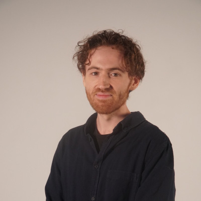
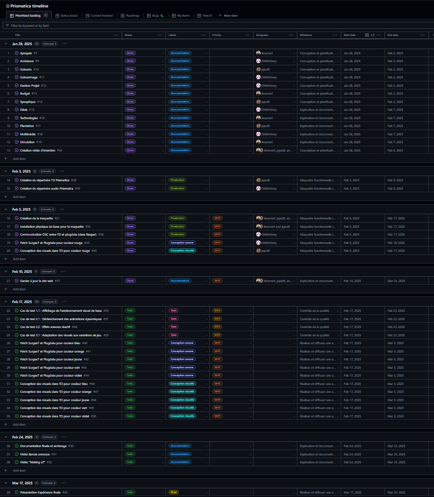
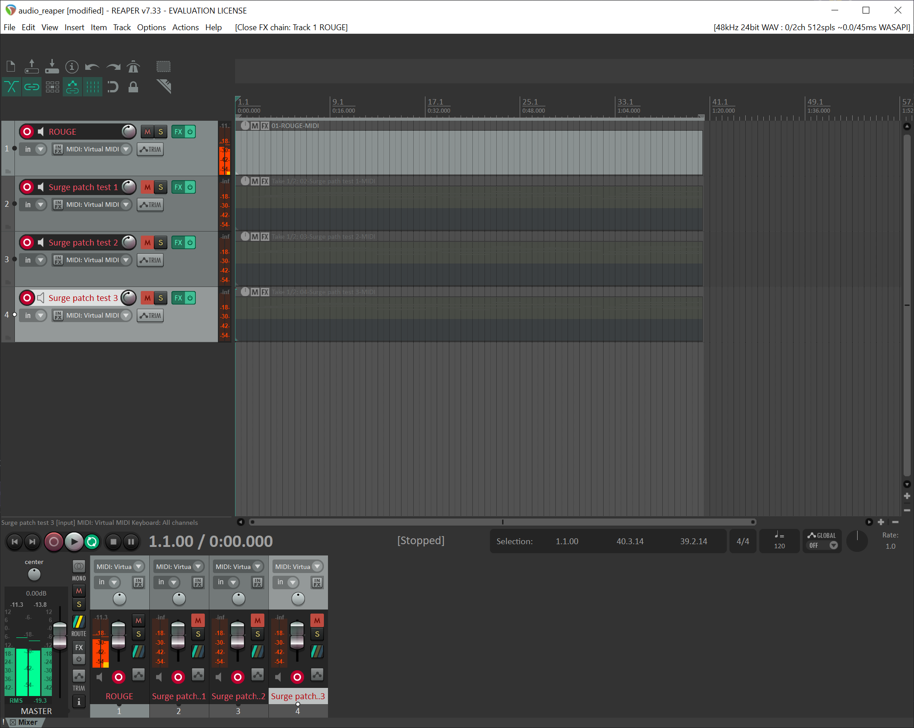
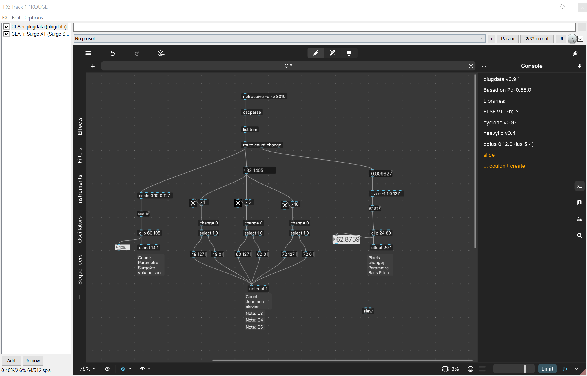
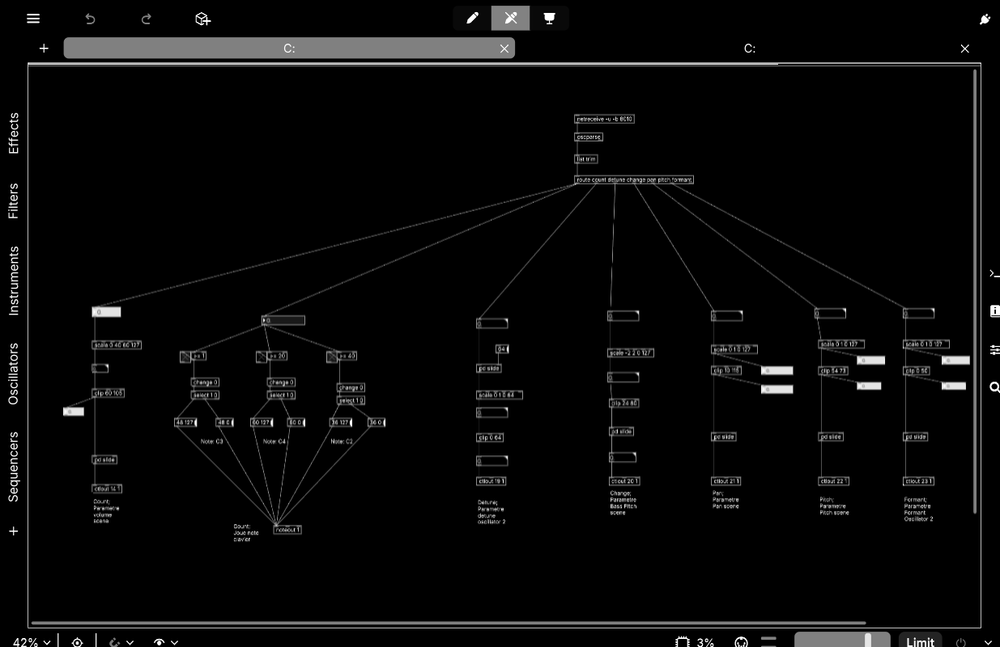
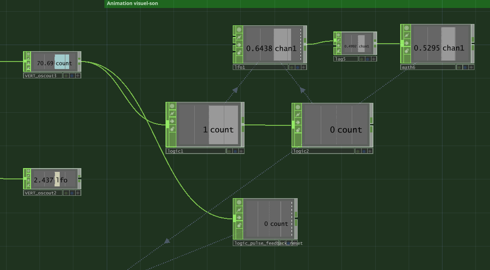
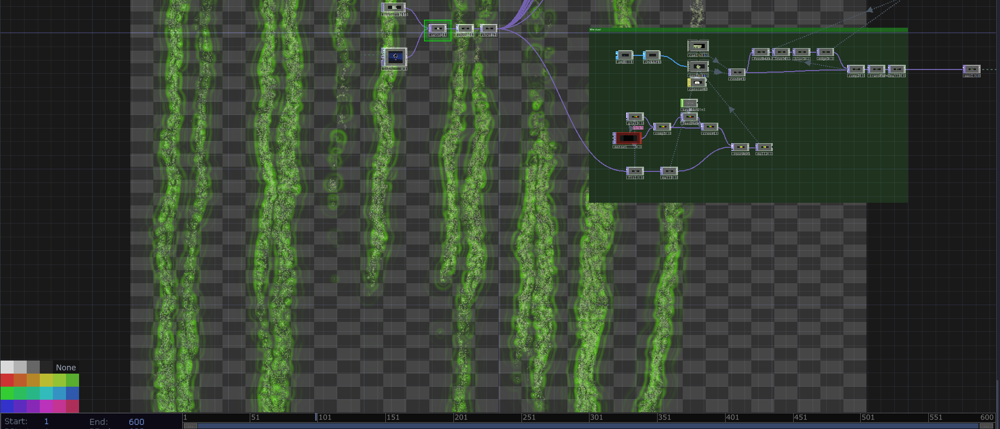
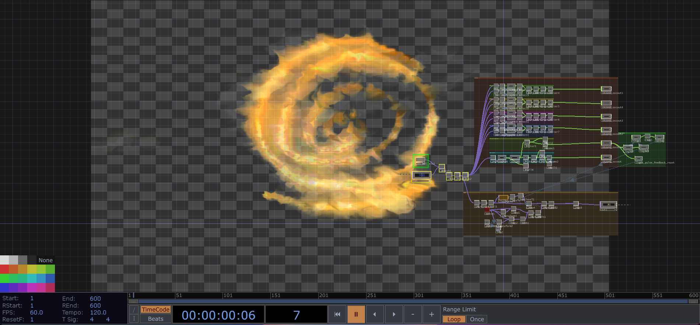

# Vincent Delisle

## Réalisations

 <!-- Une image par semaine de la réalisation dont tu es le plus fier avec une légende -->

### S1 Développement du concept

Vincent a travaillé sur le développement d’une interaction concrète en proposant une idée innovante qui renforce l’engagement de l’utilisateur et enrichit l’expérience immersive du projet.

<iframe style="border: 1px solid rgba(0, 0, 0, 0.1);" width="800" height="450" src="https://embed.figma.com/board/01QeudLWkBospPA8fs9Bte/Brainstorm?node-id=0-1&embed-host=share" allowfullscreen></iframe>

### S2 Réajustement et Redéfinition du Projet

Vincent a structuré l’organisation du travail en répartissant les tâches sur GitHub, assurant ainsi un suivi clair des rôles et des avancées de chacun.

### S3 Expérimentations et Tests

Vincent a commencé à travailler sur le son associé à la couleur rouge, en préparant les bases sonores pour son intégration dans la maquette.

### S4 Présentation de la maquette

Vincent a optimisé le son pour qu’il réagisse dynamiquement en fonction de l’intensité du dessin.

### S5 Optimisation de l’Analyse des Couleurs

Vincent a travaillé sur la logique nécessaire pour analyser les couleurs de manière plus efficace. Il a également implémenté un système permettant de diviser l’image en quatre zones distinctes, afin que l’analyse prenne en compte l’emplacement précis du trait et ajuste l’interaction sonore en conséquence.

### S6 Travail sur les Couleurs Assignées

Vincent a approfondi son travail sur les deux couleurs qui lui ont été assignées : le rouge et le vert. Il a affiné leur analyse et a développé l’intégration visuelle et sonore correspondante, en veillant à une cohérence entre l’expérience visuelle et l’ambiance sonore du projet.

### S7 Harmonisation du Patch Global

Vincent a travaillé sur le patch global en veillant à ce que toutes les couleurs, celles d’Ikrame et les siennes, s’intègrent harmonieusement. Il a ajusté les paramètres pour assurer une cohérence sonore et visuelle à l’ensemble du projet, garantissant ainsi une expérience fluide et immersive.

### S8 Derniers Tests et Harmonisation Finale

Vincent a effectué les derniers tests afin de s’assurer de l’harmonisation des couleurs et de leur cohérence avec l’ensemble du projet. Il a affiné les réglages pour garantir une interaction fluide et immersive entre les éléments visuels et sonores.
