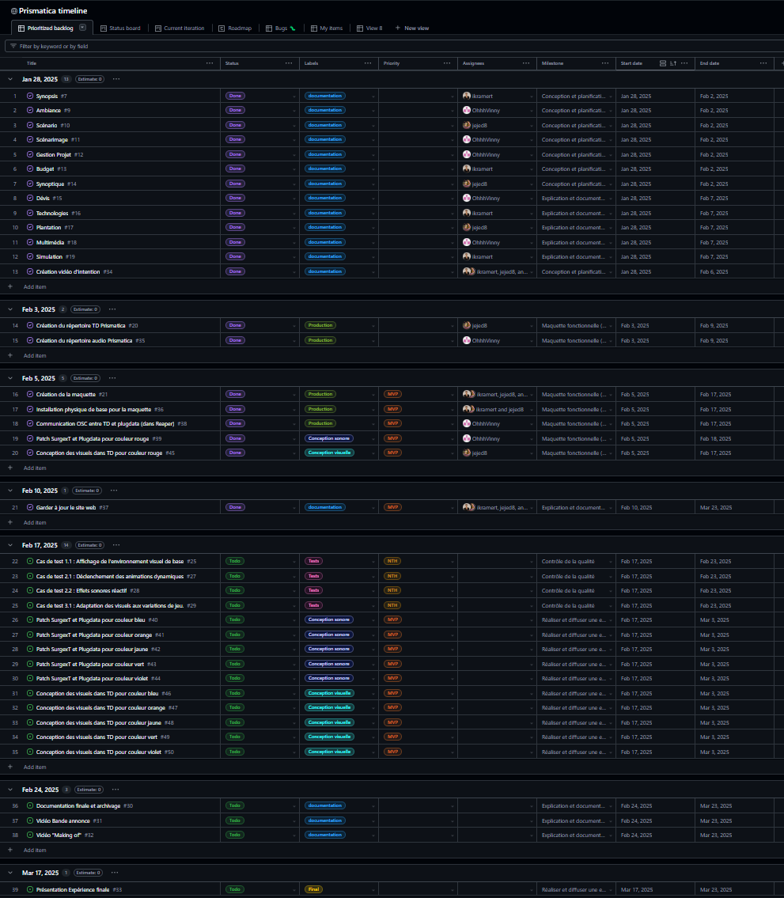
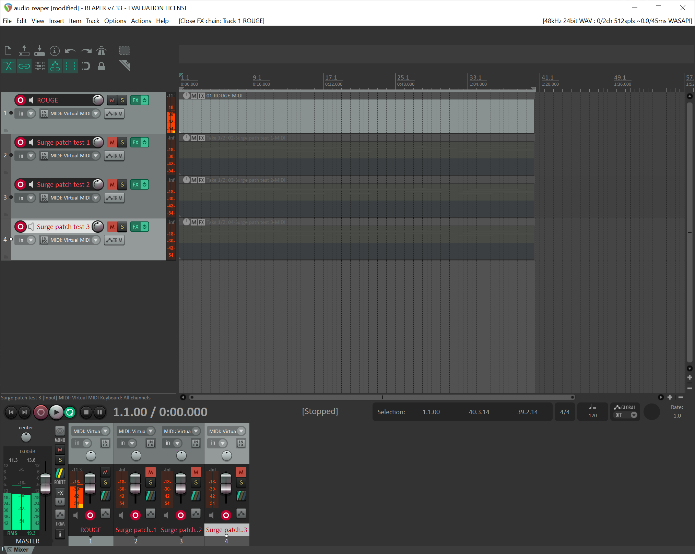
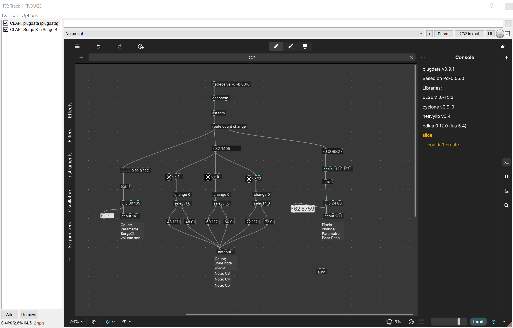

# Vincent Delisle

## Réalisations

 <!-- Une image par semaine de la réalisation dont tu es le plus fier avec une légende -->

### S1 Développement du concept

Vincent a travaillé sur le développement d’une interaction concrète en proposant une idée innovante qui renforce l’engagement de l’utilisateur et enrichit l’expérience immersive du projet.

<iframe style="border: 1px solid rgba(0, 0, 0, 0.1);" width="800" height="450" src="https://embed.figma.com/board/01QeudLWkBospPA8fs9Bte/Brainstorm?node-id=0-1&embed-host=share" allowfullscreen></iframe>

### S2 Réajustement et Redéfinition du Projet

Vincent a structuré l’organisation du travail en répartissant les tâches sur GitHub, assurant ainsi un suivi clair des rôles et des avancées de chacun.

### S3 Expérimentations et Tests

Vincent a commencé à travailler sur le son associé à la couleur rouge, en préparant les bases sonores pour son intégration dans la maquette.

### S4 Présentation de la maquette

Vincent a optimisé le son pour qu’il réagisse dynamiquement en fonction de l’intensité du dessin.
