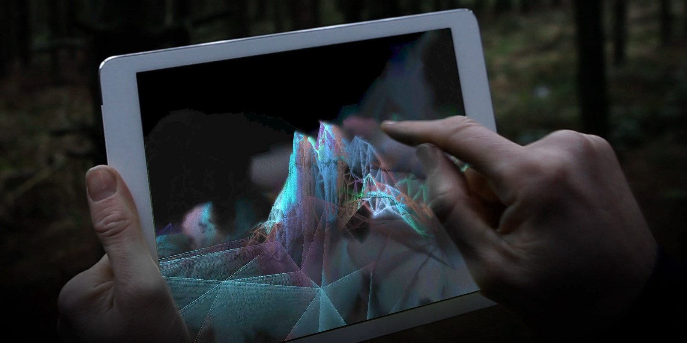

<!-- Ici mettre tous les documents et références associés à l'établissement de l'ambiance du projet   -->

# Ambiance

## Planche d'ambiances

### Références visuelles

L’expérience interactive Polyfauna, développée par Radiohead, Nigel Godrich et le studio The Mill, explore un univers visuel et sonore immersif où l’utilisateur navigue à travers des paysages abstraits en perpétuelle évolution. Inspirée des sessions d’enregistrement de l’album The King of Limbs, cette application mêle textures organiques, effets de traits dynamiques et une ambiance sonore hypnotique. La vidéo [Polyfauna – A Radiohead Experiment](https://vimeo.com/106160168) illustre cette atmosphère onirique où formes et couleurs se transforment au fil de l’exploration. Ce projet influence notre approche en matière de composition visuelle, d’esthétique générative et d’ambiance immersive, notamment par l’usage de lignes fluides, de palettes chromatiques vibrantes et de sonorités éthérées pour renforcer l’expérience sensorielle.

### Références Sonores

L’ambiance sonore de ce projet repose sur une approche synesthésique, où chaque couleur utilisée par l’utilisateur dans son dessin génère une réponse sonore spécifique. Cette correspondance entre visuel et son s’inspire des travaux d’artistes et de compositeurs ayant exploré la relation entre les couleurs et les fréquences sonores, comme Olivier Messiaen et Wassily Kandinsky.

L’objectif est de créer une immersion multisensorielle en associant chaque teinte à une sonorité particulière, soit par une correspondance avec des fréquences (conversion de longueurs d’onde lumineuses en sons), soit par une approche musicale où chaque couleur est liée à une note ou une gamme harmonique. Cette association renforcera le lien entre le geste du dessinateur et l’ambiance sonore, transformant chaque trait en une impulsion musicale.

L’expérience sonore s’inspirera des paysages sonores synthétiques et évolutifs de projets comme Polyfauna ou des compositions modulaires génératives. Les sons seront conçus à l’aide de synthétiseurs d’ambiance, créant des nappes sonores immersives qui fluctuent en fonction de l’interaction de l’utilisateur.

- [Relaxing Experimental Ambient Mix](https://youtu.be/1oQRHi4-uQc?si=8vEqAw7KazlImLgM)
- [What's It Like To Hear Colors?](https://youtu.be/obrBAysVef0?si=qgDhofNB_TuuUqj-)
- [Folding Space - Generative Modular Ambient](https://www.youtube.com/live/6JeZR13dLLI?si=Ti5t_jfCJFJclvHG)

### Références

- [Figma](https://www.figma.com/board/01QeudLWkBospPA8fs9Bte/Brainstorm?node-id=0-1&t=8gxj0QlvFJdMzD7w-1)
