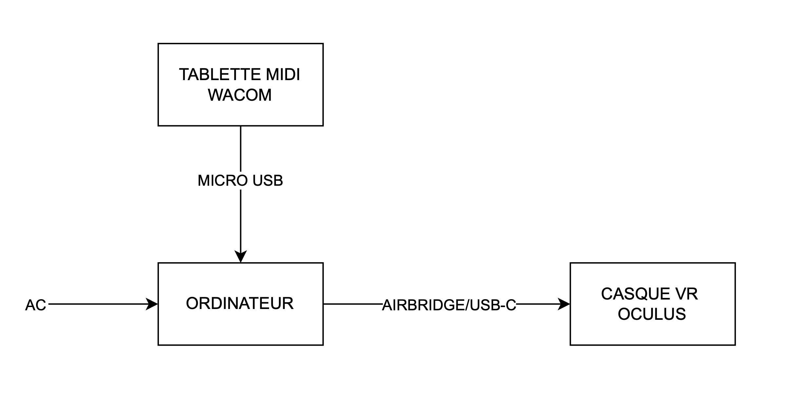
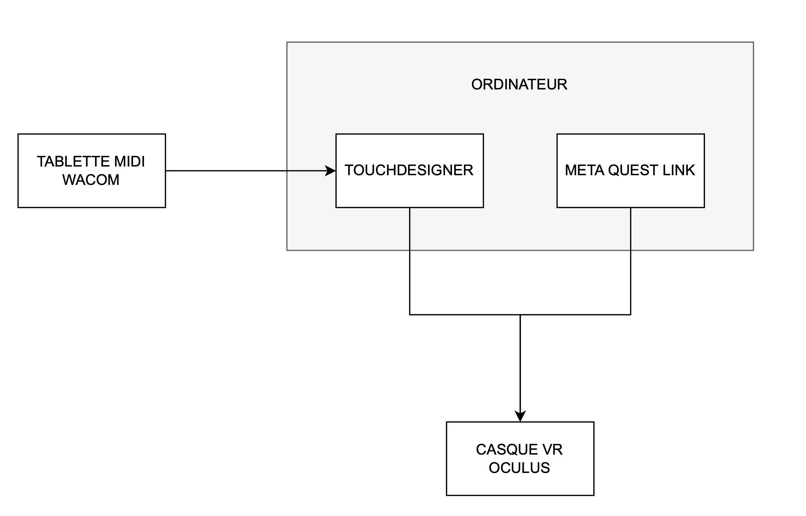

# Synoptique

---

- **ORDINATEUR 💻** :  L'ordinateur sert de machine principale qui exécute l'expérience VR. Il gère les graphismes, le son et les interactions en temps réel. Il exécute l'application VR et traite les entrées de la tablette Wacom et du casque Oculus pour générer les effets sonores et visuels en fonction des actions de l'interacteur.

- **CASQUE VR OCULUS 🥽** : Le casque immerge l'interacteur dans l'univers de l'expérience.

- **TABLETTE MIDI WACOM 🎨** : La tablette sert d’interface d'interaction principale. L’interacteur l’utilise pour modifier et manipuler le monde VR ou en effectuant des gestes spécifiques. En fonction des tracés et des pressions exercées sur la tablette, le système génère des effets visuels et sonores en temps réel, créant ainsi une expérience interactive inspirée de la synesthésie.
---

- **TouchDesigner** : Crée l'univers visuel et sonore dynamique, en réponse aux interactions avec la tablette Wacom.

- **Meta Quest Link** : Permet de connecter le casque VR à l’ordinateur, offrant une expérience plus riche et puissante sur ton projet VR.

<!-- 
## Références

### Théorie (À supprimer quand section terminée)
* [Synoptique](https://tim-montmorency.com/582523-gestion/#/contenus/3_planification/10_synoptique/)

-->