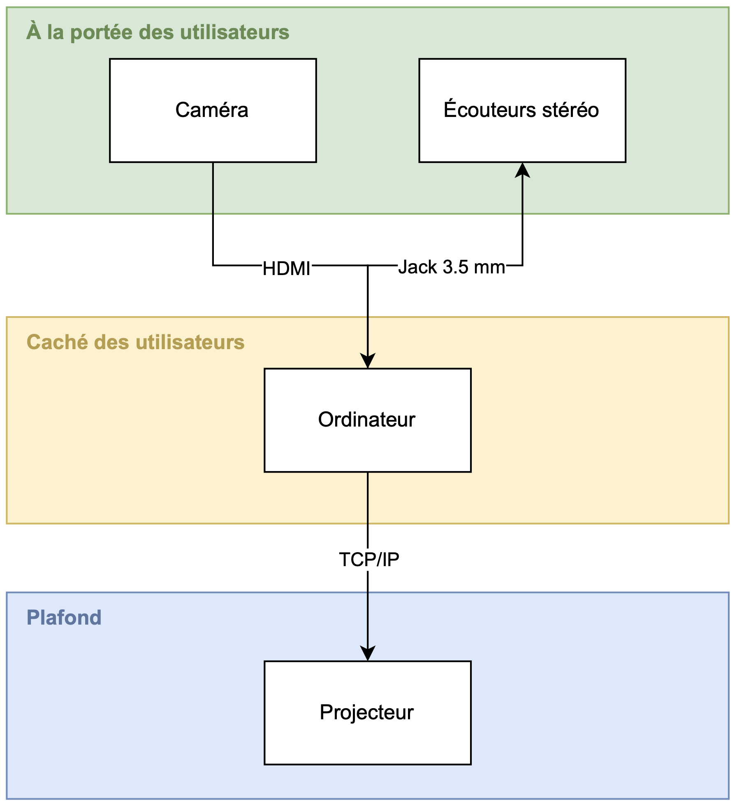

# Synoptique

 

 

## Schéma des Composantes et Leurs Utilités

| Composante                | Rôle dans le projet |
|---------------------------|--------------------|
| **Tablette à dessin Wacom** | Permet aux utilisateurs de dessiner. Les données sont envoyées en temps réel à TouchDesigner via USB. |
| **Écouteurs stéréo**       | Restituent les sons générés par TouchDesigner en fonction du dessin de l’utilisateur. |
| **Ordinateur**             | Analyse les dessins en temps réel avec TouchDesigner, génère les visuels et les sons, et envoie l'affichage au projecteur via TCP/IP. |
| **Projecteur**             | Affiche en grand les visuels générés en temps réel sur le mur, offrant une expérience immersive. |

## Fonctionnement du Système

1. L’utilisateur dessine sur la tablette Wacom.  
2. TouchDesigner reçoit les données du dessin et génère des visuels et sons correspondant à chaque trait.  
3. Les sons sont diffusés dans les écouteurs et les visuels sont projetés sur le mur en temps réel.  

---

<!-- 
## Références

### Théorie (À supprimer quand section terminée)
* [Synoptique](https://tim-montmorency.com/582523-gestion/#/contenus/3_planification/10_synoptique/)

-->