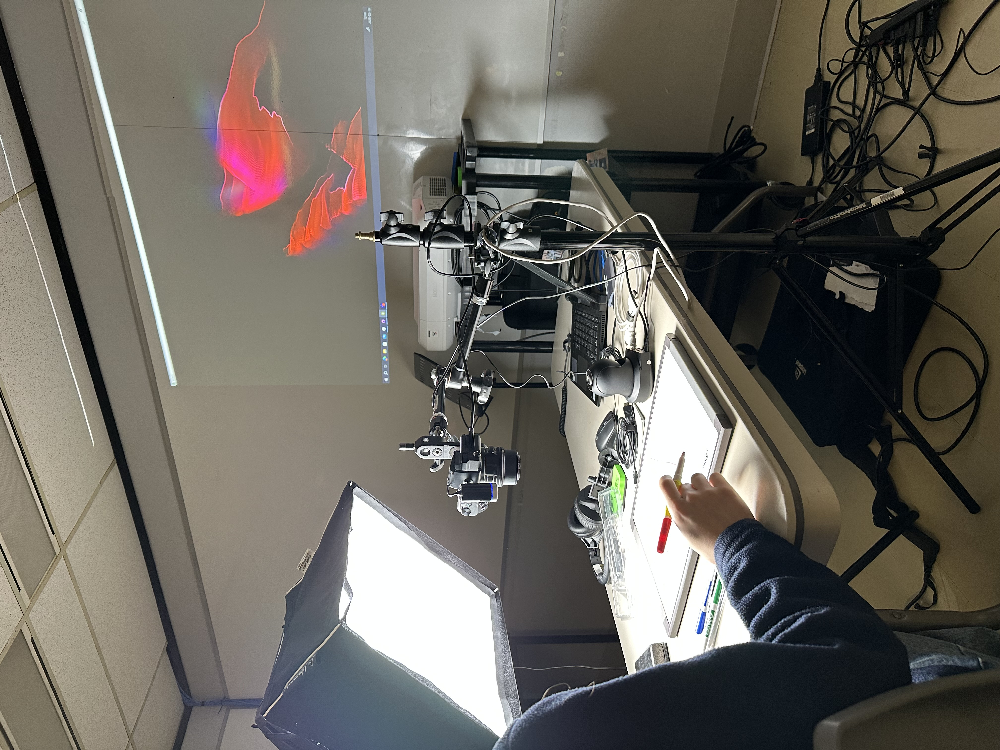
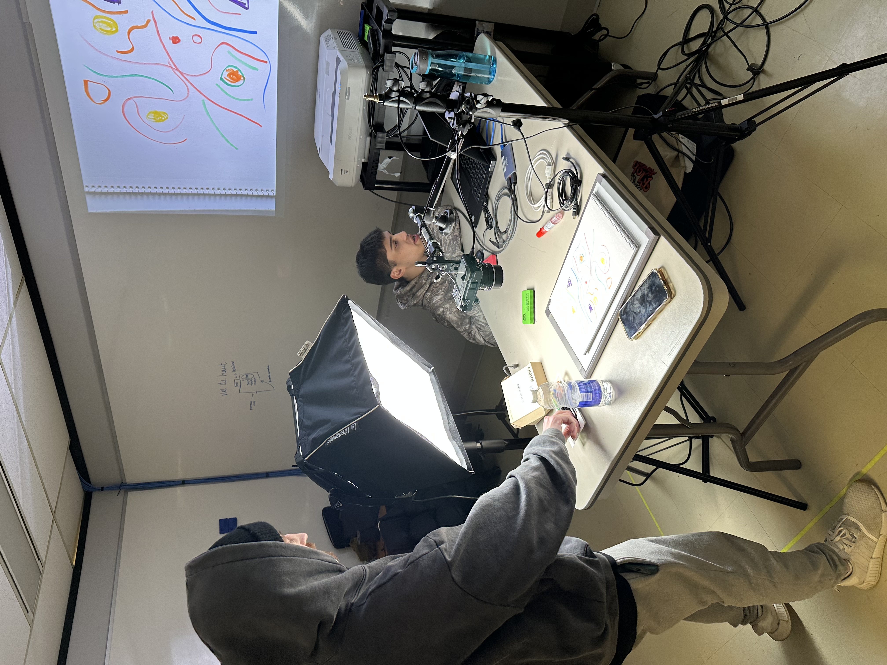

# Maquette

La maquette illustre l’interaction de l’utilisateur avec l’installation. Une caméra éclaire un tableau effaçable sur lequel il est possible de dessiner des traits. Jeremy a développé le visuel associé à la couleur rouge : une animation rouge apparaît dès que l’interacteur dessine avec un crayon de cette couleur. Vincent, quant à lui, a conçu le son en corrélation avec la couleur, en fonction de la densité des pixels sur le tableau. Plus l’interacteur utilise du rouge, plus le son s’intensifie, créant une atmosphère qui suscite un sentiment d’urgence.

La maquette a été réalisée à l’aide d’un Sony A6400 pour capturer l’imagerie, d’un ordinateur portable Dell intégrant les logiciels Reaper et TouchDesigner, ainsi que de marqueurs de différentes couleurs, dont le rouge. Un panneau lumineux a été utilisé pour diffuser une lumière blanche, et la caméra a été ajustée en conséquence. Lorsqu’on s’assoit, l’installation nous accueille avec un casque audio, plongeant l’interacteur dans une immersion sonore complète.

Le résultat obtenu démontre la fonctionnalité de notre idée et nous conduit à approfondir l’aspect du trait avec davantage de complexité.

## Gallerie d'images

- 
- 
- 
- 

## Vidéo du la maquette en action

<!-- ## Références

- [Étude de faisabilité](https://tim-montmorency.com/582523-gestion/#/contenus/4_faisabilite/10_etude/)
- [Maquette](https://tim-montmorency.com/582523-gestion/#/contenus/4_faisabilite/30_maquette/)

-->
